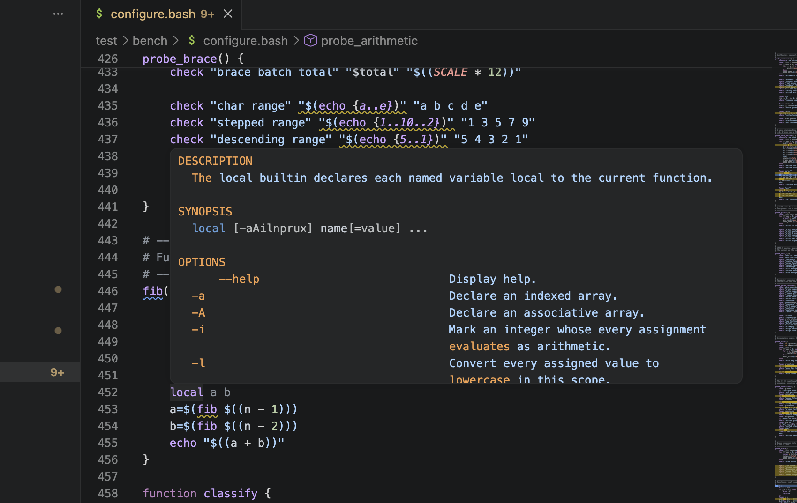

# koshka for VS Code

This repository hosts [Koshka Shell](https://github.com/fennec-support/kosh)
tooling for VS Code and its descendants.

Currently that includes:
- Linter
- LSP/Symbols
- Formatter

You should probably install this extension from the [marketplace](https://marketplace.visualstudio.com/items?itemName=fluffyfen.kosh).

| kosh lsp in action. |
| - |
|  |

### Installing a release

Download `kosh.vsix` from the
[releases](https://github.com/fennec-support/kosh-vscode/releases) page and
run:
```bash
code --install-extension kosh.vsix
```

### Manual installation

```bash
npm install
npm run compile
npm run package
code --install-extension kosh.vsix
```

### Updates

Once per session the extension compares the version printed by
`kosh --version` with the newest release. It offers to update the binary it
downloaded itself, and only notifies you when `kosh.path` or PATH holds an
older one.

### Settings

The values below are the defaults.

```jsonc
{
  // Start the Koshka language server.
  "kosh.enable": true,

  // Name or absolute path of the kosh binary. The extension looks up a bare
  // name in PATH.
  "kosh.path": "kosh",

  // Arguments placed before --as-language-server.
  "kosh.arguments": [],

  // Trace level for messages between VS Code and the server: "off",
  // "messages", or "verbose".
  "kosh.trace.server": "off"
}
```
